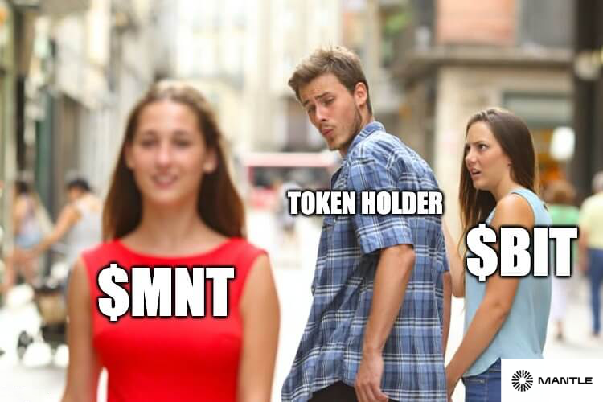
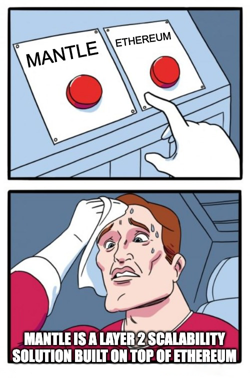
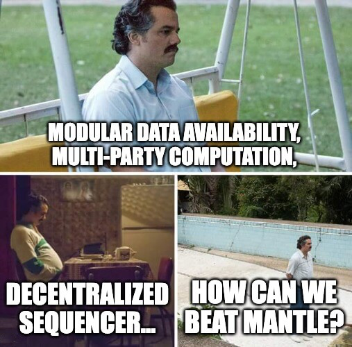
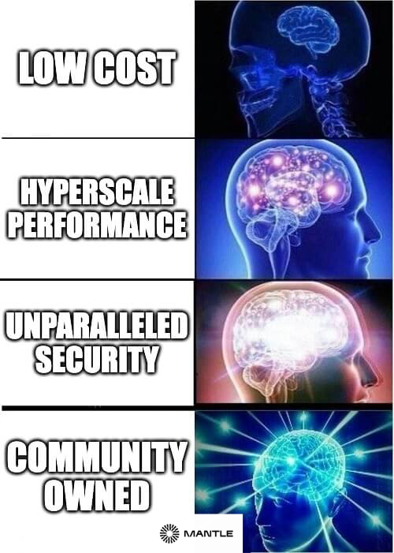
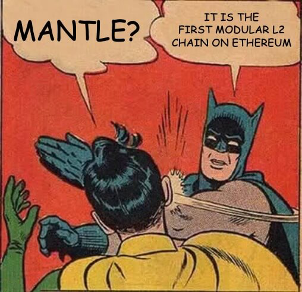
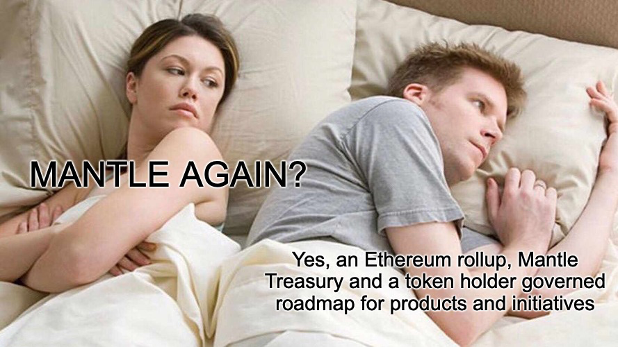
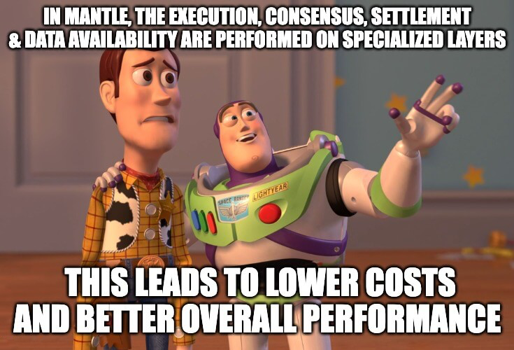

# MANTLE EDUCATIONAL MEMES

A serie of fun and engaging memes that educates people about [Mantle](https://www.mantle.xyz/) and its benefits created for the [Encode x Mantle hackathon](https://www.encode.club/mantle-hackathon)

Find a [presentation here in the repo](https://github.com/ivanmolto/best-content-memes/blob/main/best-educational-memes-ivanmolto.pdf) or [download it from Pinata.cloud](https://ivanmolto.mypinata.cloud/ipfs/Qmdr9KPaWADPLywGtTydrGunZNy1RWE61hYnDiKDgsnTyV?_gl=1*1u7eo01*rs_ga*ODhhNzU4NWEtNGMwZS00ODExLWE2YmQtZGE4ZDZjYmU4N2I0*rs_ga_5RMPXG14TE*MTY4NjYwMjgxMy4yMC4xLjE2ODY2MDMwMDAuNjAuMC4w)

---

---

---

---

---

---

